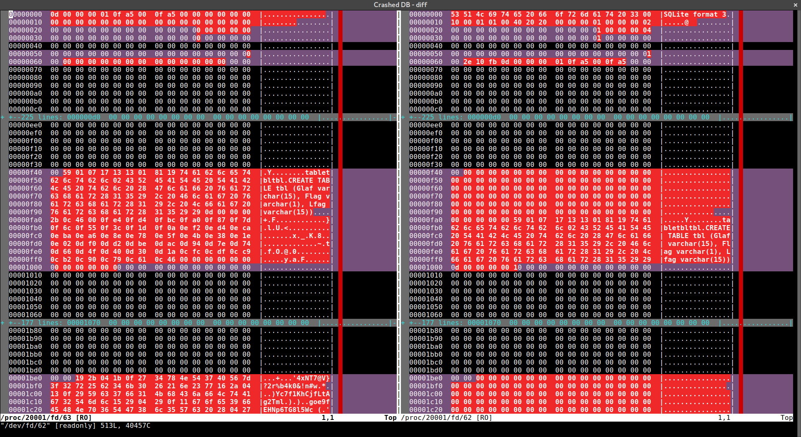

Crashed DB
===
**Category:** Forensics **Points:** 50, **Solves:** 52, **Our rank:** 36

> We lost some data when we were delivering our DB.
> Can you recover it??
> Hint: SQLite

### Write-up
We are given a single file called `db0.db`, containing binary data. `File` gives some result:


```
$ file db0.db
db0.db: dBase III DBT, version number 0, next free block index 13
```

but it's misleading - it is some old database format, nothing to do with sqlite. `Hexdump` is more helpful:

```
mdebski@rockstar:~/ctf/sharif-8/crashed_db$ hexdump -C db0.db
00000000  0d 00 00 00 01 0f a5 00  0f a5 00 00 00 00 00 00  |................|
00000010  00 00 00 00 00 00 00 00  00 00 00 00 00 00 00 00  |................|
*
00000f40  00 59 01 07 17 13 13 01  81 19 74 61 62 6c 65 74  |.Y........tablet|
00000f50  62 6c 74 62 6c 02 43 52  45 41 54 45 20 54 41 42  |bltbl.CREATE TAB|
00000f60  4c 45 20 74 62 6c 20 28  47 6c 61 66 20 76 61 72  |LE tbl (Glaf var|
00000f70  63 68 61 72 28 31 35 29  2c 20 46 6c 61 67 20 76  |char(15), Flag v|
00000f80  61 72 63 68 61 72 28 31  29 2c 20 4c 66 61 67 20  |archar(1), Lfag |
00000f90  76 61 72 63 68 61 72 28  31 35 29 29 0d 00 00 00  |varchar(15))....|
00000fa0  2b 0c 46 00 0f e4 0f d4  0f bc 0f a0 0f 87 0f 7d  |+.F............}|
00000fb0  0f 6c 0f 55 0f 3c 0f 1d  0f 0a 0e f2 0e d4 0e ca  |.l.U.<..........|
00000fc0  0e ba 0e a6 0e 8e 0e 78  0e 5f 0e 4b 0e 38 0e 1e  |.......x._.K.8..|
00000fd0  0e 02 0d f0 0d d2 0d be  0d ac 0d 94 0d 7e 0d 74  |.............~.t|
00000fe0  0d 66 0d 4f 0d 40 0d 30  0d 1a 0c fc 0c df 0c c9  |.f.O.@.0........|
00000ff0  0c b2 0c 90 0c 79 0c 61  0c 46 00 00 00 00 00 00  |.....y.a.F......|
00001000  00 00 00 00 00 00 00 00  00 00 00 00 00 00 00 00  |................|
*
00001be0  00 00 19 2b 04 1b 0f 27  34 78 4e 54 37 40 56 7d  |...+...'4xNT7@V}|

// Some seemingly random binary data omitted

00001f90  37 6c 78 4f 53 4e 23 78  34 7a 41 76              |7lxOSN#x4zAv|
```

String `CREATE TABLE tbl (Glaf varchar(15), Flag varchar(1), Lfag varchar(15))` is clearly visible. Hint mentions sqlite, so let's try!

```
$ sqlite3 valid.db
SQLite version 3.19.3 2017-06-08 14:26:16
Enter ".help" for usage hints.
sqlite> CREATE TABLE tbl (Glaf varchar(15), Flag varchar(1), Lfag varchar(15));
sqlite> ^D
$ vimdiff <(hexdump -vC db0.db) <(hexdump -vC valid.db)
```


Yup, looks pretty similar. Well, other than the new, empty db has zeros instead of the data at the end and everything seems shifted by 100 bytes...

```
$ head --bytes 100 valid.db > recovered.db
$ cat db0.db >> recovered.db
$ sqlite3 recovered.db
SQLite version 3.19.3 2017-06-08 14:26:16
Enter ".help" for usage hints.
sqlite> .schema tbl
CREATE TABLE tbl (Glaf varchar(15), Flag varchar(1), Lfag varchar(15));
sqlite> select Flag from tbl;
S
h
a
r
i
f
C
T
F
{
9
d
a
6
c
5
6
0
5
1
6
c
1
3
e
0
8
d
0
2
8
9
3
f
9
9
c
a
5
4
5
f
}
sqlite> select GROUP_CONCAT(Flag, "") from tbl;
SharifCTF{9da6c560516c13e08d02893f99ca545f}
```

So the db was apparently only missing 100 bytes of header, and the flag is `SharifCTF{9da6c560516c13e08d02893f99ca545f}`
