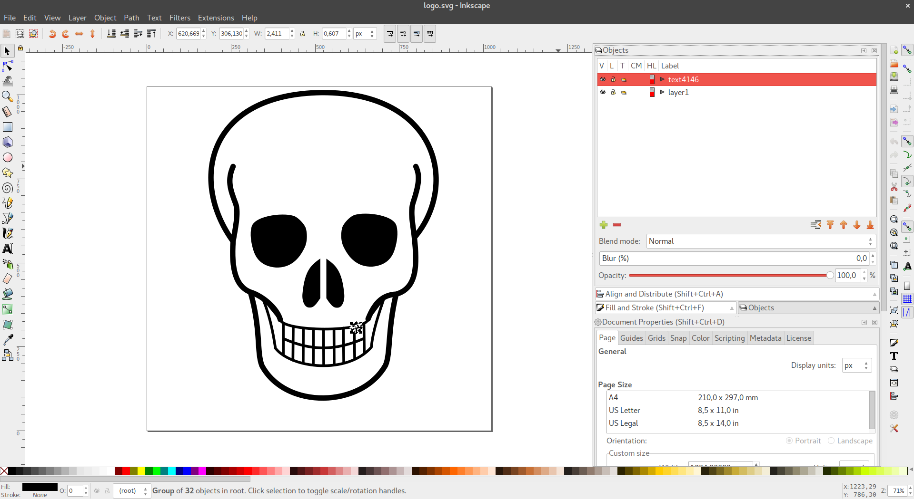
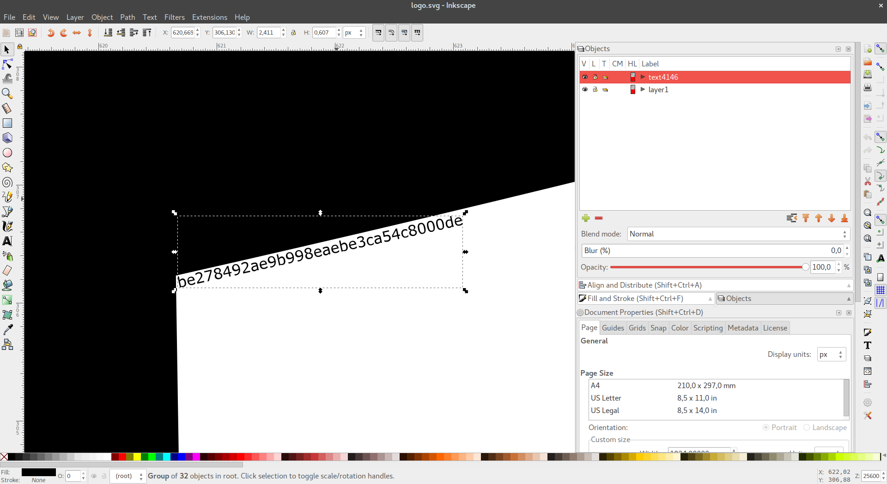

The Skeleton Key
===
**Category:** Misc **Points:** 200, **Solves:** 47, **Our rank:** 40

> Find the flag :)

### Write-up
Download is 1,1MB APK file - an Android application. I'm no expert on (or fan of) Android, so I started as with any java app:

```
$ jar tvf The\ Skeleton\ Key.apk
  1852 Sun Dec 11 22:49:44 CET 2016 AndroidManifest.xml
 28488 Sun Dec 11 22:49:44 CET 2016 assets/logo.svg
   396 Sun Dec 11 22:49:44 CET 2016 res/anim/abc_fade_in.xml
   396 Sun Dec 11 22:49:44 CET 2016 res/anim/abc_fade_out.xml
// Tons of similar xml, png files in res/ omitted.
  4366 Sun Dec 11 22:49:26 CET 2016 res/mipmap-xhdpi-v4/ic_launcher.png
  7007 Sun Dec 11 22:49:26 CET 2016 res/mipmap-xxhdpi-v4/ic_launcher.png
  9490 Sun Dec 11 22:49:26 CET 2016 res/mipmap-xxxhdpi-v4/ic_launcher.png
175932 Sun Dec 11 22:49:28 CET 2016 resources.arsc
2114044 Sun Dec 11 22:49:44 CET 2016 classes.dex
 31057 Sun Dec 11 22:49:44 CET 2016 META-INF/MANIFEST.MF
 31086 Sun Dec 11 22:49:44 CET 2016 META-INF/CERT.SF
  1107 Sun Dec 11 22:49:44 CET 2016 META-INF/CERT.RSA
```

We can use [dex2jar](https://github.com/pxb1988/dex2jar) to extract java class files from `classes.dex`.
```
$ ls sharif/cert/sharif/
BuildConfig.class   R$anim.class  R$bool.class  R$color.class  R$drawable.class  R$integer.class  R$mipmap.class  R$styleable.class
MainActivity.class  R$attr.class  R.class       R$dimen.class  R$id.class        R$layout.class   R$string.class  R$style.class
```
Then decompile the classes and read java bytecode.


```
$ for I in $(ls *.class); do javap -c $I > src/$I.j; done
$ cd src/
$ wc -l *
    19 BuildConfig.class.j
    33 MainActivity.class.j
    27 R$anim.class.j
   413 R$attr.class.j
    21 R$bool.class.j
     7 R.class.j
   153 R$color.class.j
   155 R$dimen.class.j
   133 R$drawable.class.j
   189 R$id.class.j
    17 R$integer.class.j
    81 R$layout.class.j
     9 R$mipmap.class.j
    45 R$string.class.j
  1856 R$styleable.class.j
   613 R$style.class.j
  3771 total
```

Most of the classes are some boilerplate code, see for example [R$styleable.class.j](R_styleable.class.j). `MainActivity` sounds like an interesting part, and looks like that:
```
public class sharif.cert.sharif.MainActivity extends android.support.v7.app.AppCompatActivity {
  public sharif.cert.sharif.MainActivity();
    Code:
       0: aload_0
       1: invokespecial #8                  // Method android/support/v7/app/AppCompatActivity."<init>":()V
       4: return

  protected void onCreate(android.os.Bundle);
    Code:
       0: aload_0
       1: aload_1
       2: invokespecial #13                 // Method android/support/v7/app/AppCompatActivity.onCreate:(Landroid/os/Bundle;)V
       5: aload_0
       6: ldc           #14                 // int 2130968600
       8: invokevirtual #18                 // Method setContentView:(I)V
      11: aload_0
      12: ldc           #19                 // int 2131492941
      14: invokevirtual #23                 // Method findViewById:(I)Landroid/view/View;
      17: checkcast     #25                 // class android/webkit/WebView
      20: astore_1
      21: aload_1
      22: invokevirtual #29                 // Method android/webkit/WebView.getSettings:()Landroid/webkit/WebSettings;
      25: iconst_1
      26: invokevirtual #35                 // Method android/webkit/WebSettings.setJavaScriptEnabled:(Z)V
      29: aload_1
      30: ldc           #37                 // String
      32: ldc           #39                 // String <p></p>
      34: ldc           #41                 // String text/html
      36: ldc           #43                 // String utf-8
      38: ldc           #37                 // String
      40: invokevirtual #47                 // Method android/webkit/WebView.loadDataWithBaseURL:(Ljava/lang/String;Ljava/lang/String;Ljava/lang/String;Ljava/lang/String;Ljava/lang/String;)V
      43: return
}
```

So it initializes a `WebView`, and displays the logo from assets in it. After looking through rest of the code,
I failed to find any sign of this app doing anything more, and not beliving it decided to run it.
After some struggling with android emulators it turned out that yup, that's really all. God knows why android needs 15 classes and tens of xml and png files for that.
So I turned to the only remaining thing - the [logo itself](logo.svg).






Disappointing. Inkscape -> Object -> Objects and zoom in was all it takes. The flag is SharifCTF{be278492ae9b998eaebe3ca54c8000de}.
