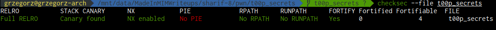

# SharifCTF 8 Writeup

## t00p_secrets (250) - 17 solves

```
Someone has designed this top secret management service for us. He was insisting on the term 't00p'. Could you please take a look and find out why?
nc ctf.sharif.edu 22107
Alternative: nc 213.233.161.38 22107
```

## Writeup

We are provided with an 64 bit ELF [executable](t00p_secrets). After running `checksec --file t00p_secrets` we get:



After reverse engineering the binary we obtain the following pseudocode:

```c
initialize();
while(1)
{
    do
        authenticate();
    while(!authenticated);

    display_menu();

    switch(get_option())
    {
        case 1:
            create_a_secret();
            break;
        case 2:
            delete_a_secret();
            break;
        case 3:
            edit_a_secret();
            break;
        case 4:
            print_all_secrets();
            break;
        case 5:
            print_one_secret();
            break;
        case 6:
            exit(0);
            break;
        case 7:
            change_authentication_key();
            authenticated = 0;
            break;
    }
}
```

The binary first asks us to authenticate by providing an password - the correct answer is stored in an buffer in the .bss section - the binary initializes this buffer to the hardcoded string `wjigaep;r[jg]ahrg[es9hrg`. After authenticating we are provided with an secret storage interface. A secret is an storage buffer on the heap and can contain either binary data or an string. A pointer to the secret together with the size and the type(string or binary) of the secret are stored in an array in the .bss segment. We can create, delete, view and change a secret - this looks like an heap exploitation challenge. Indeed - the routine responsible for storing an user supplied string in an secret contains an off by one error which allows the null terminator of the string to be written exactly one byte after the end of the malloced region. This off by one error can be leveraged by the [House Of Einherjar](https://github.com/shellphish/how2heap/blob/master/house_of_einherjar.c) technique.

Although this is a viable solution the binary contains another vulnerability which allows for much easier exploitation. The secrets are indexed by their corresponding id - this allows the binary to store pointers to them in an global array in the .bss section. The create_secret, delete_secret and print_one_secret functions correctly check the bounds on the supplied secret id. The edit_a_secret function on the other hand does not check whether we supplied an valid id or an valid secret type. The pseudocode for the edit_a_secret function is:

```c
void edit_a_secret()
{
    unsigned int id;
    scanf("%u%*c", &id);
    if(secret_sizes[id] == -1)
        puts("No such secret!");
    else
    {
        unsigned short type;
        scanf("%hu%*c", &type);
        if(secret_sizes[id] > 0)
        {
            load_secret_contents(secret_ptrs[id], secret_sizes[id], type);
        }
        secret_types[id] = type; //2 byte write
    }
}
```

The secret_ptrs, secret_sized and secret_types arrays each contain 7 entries. By providing an id bigger than 7 we can make an out of bounds read from these arrays. The .bss section is initialized to 0 which means that by providing a big enough id `secret_sizes[id]` will be 0 - this allows us to bypass the load_secret_contents function which would otherwise crash the program. This allows us to write 2 bytes at an big enough offset. It turns out that we are able to write at offsets bigger than ~20. Offsets from 28 to 32 correspond to `secret_sizes[5]` and offsets from 72 to 76 correspond to `secret_ptrs[5]`. This allows us to read and write to an arbitrary memory location by setting up these table entries and then executing the print_one_secret or edit_a_secret function.

PIE is disabled so we read the Global Offset Table. By using [libc-database](https://github.com/niklasb/libc-database) we locate the [libc](libc6_2.23-0ubuntu10_amd64.so) running on the remote system. Full RELRO is enabled so we cannot overwrite GOT entries to hijack flow control. As we know the base address of the libc we overwrite `__malloc_hook` with the address of a one shot gadget. I used the great tool [one-gadget](https://github.com/david942j/one_gadget) for finding such gadgets. After `__malloc_hook` was overwritten with an appropriate gadget we trigger the shell by creating a new secret. The exploit is [here](exploit.py)


The flag is `SharifCTF{R34V1L1NG_S3CR3T5_VI4_51NGL3_NULL_BY73}` which tells me that the challenge was intended to be solved by using [House Of Einherjar](https://github.com/shellphish/how2heap/blob/master/house_of_einherjar.c) - heh my solution works fine and no heap exploitation techniques required :)

###### By [gorbak25](https://github.com/grzegorz225) <gorbak25@gmail.com>
